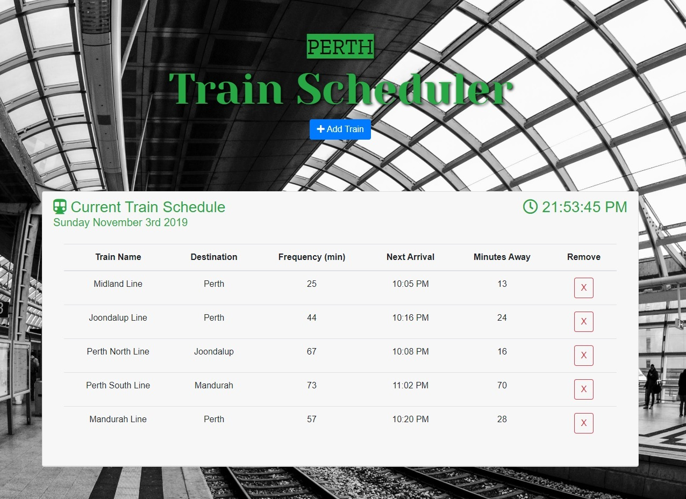

# Train Scheduler

## 

## Features:

- Mobile Responsive.
- Displays current date and time.
- When adding trains, administrators can submit the following:
  Train Name,
  Destination,
  First Train Time (in 24 hour time),
  Frequency (in minutes).

- Coded to calculate when the next train will arrive, relative to the current time.
- Users from many different machines are able to view the same train times.
- Page updates every 60 seconds.
- button added in table to remove Trains from table.

## Built With;

- HTML5
- CSS3
- Bootstrap
- Font Awesome
- Google Fonts
- JavaScript
- Jquery
- Moment.js
- Firebase

## link to Train Scheduler App:

https://mg1982.github.io/TrainScheduler/index.html
